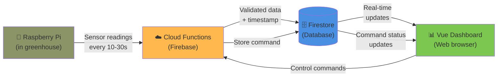

# 1. Executive Summary

## What the System Does

The greenhouse dashboard is a real-time IoT monitoring and control system that connects
a Raspberry Pi in a physical greenhouse to a web-based dashboard accessible from any
browser. The Pi reads sensors (temperature, humidity, soil moisture) and reports actuator
states (heater, fan, misters). The dashboard displays this data in real time and allows
users to send control commands back to the Pi.

## Problem It Solves

Greenhouses require continuous monitoring, but checking conditions in person is
impractical. This system provides remote, real-time visibility into greenhouse conditions
and remote control of actuators, all without managing any server infrastructure.

## Key Components

The system consists of four main parts:

- **Raspberry Pi** — reads physical sensors and actuators in the greenhouse, sends data
to the cloud, and executes incoming commands.
- **Firebase Cloud Functions** — serverless functions that validate and process data from
the Pi and commands from the dashboard.
- **Firestore** — a real-time NoSQL database that stores device state, measurement
history, and command records, and pushes updates to connected clients.
- **Vue 3 Dashboard** — a web application that displays real-time status cards,
historical charts, manual controls, and a command audit trail.

## Current State

The dashboard frontend, Cloud Functions, Firestore schema, and authentication are built
and functional. The Raspberry Pi integration (sensor reading, command execution, and
Cloud Function calls) is in progress and will be built by the project team. An
`updateCommand` Cloud Function for the Pi to mark commands as executed is not yet
implemented.

---

# 2. System Architecture

## High-Level Diagram



## Main Components

**Raspberry Pi (Data Source):** Reads physical sensors via GPIO pins and sends
structured JSON payloads to the `submitMeasurement` Cloud Function at a configurable
interval (e.g., every 30 seconds). Also polls Firestore for pending commands, executes
them via GPIO, and updates their status. The Pi integration code is not yet complete.

**Cloud Functions (Logic Layer):** Two serverless functions act as the secure boundary
between external callers and the database. `submitMeasurement` validates sensor data and
writes it to Firestore. `createCommand` validates user commands and stores them with a
`pending` status. Cloud Functions ensure the Pi never needs direct database credentials
and that all data is validated before storage.

**Firestore (Database):** Stores three collections: `devices` (current greenhouse
state), `measurements` (historical sensor readings), and `commands` (control command
audit trail). Firestore provides real-time listeners that push data changes to the
dashboard without polling.

**Vue Dashboard (User Interface):** A single-page application that subscribes to
Firestore via real-time listeners. It displays seven status cards, three historical
charts, manual control buttons, and a command history table. Users must authenticate
before accessing the dashboard.

## Data Flows

### Sensor Reading Flow

1. Pi reads sensors and actuator states.
2. Pi calls `submitMeasurement` Cloud Function with a JSON payload.
3. Cloud Function validates the data, adds a server timestamp, and writes to both
`/measurements` (new document) and `/devices/greenhouse-01` (update current state).
4. Firestore notifies all active dashboard listeners.
5. Dashboard re-renders status cards and charts with the new data.

Total latency from sensor read to screen update is typically 2–5 seconds.

### Command Flow

1. User clicks a control button (e.g., "Heater ON") on the dashboard.
2. Dashboard calls `createCommand` Cloud Function with the device ID, command type, and
value.
3. Cloud Function verifies authentication, creates a command document with status
`pending` in `/commands`.
4. Dashboard listener picks up the new command and displays it as "pending" in the
command history table.
5. Pi polls `/commands` for pending commands, executes them via GPIO, and updates the
command status to `executed` or `rejected`.
6. Dashboard listener sees the status change and updates the table.

### Key Files

| File | Purpose |
| --- | --- |
| `/src/views/DashboardView.vue` | Main dashboard page |
| `/src/services/deviceService.ts` | Real-time listener for device state |
| `/src/services/measurementService.ts` | Real-time listener for measurements |
| `/src/services/commandService.ts` | Command sending and history listener |
| `/functions/src/index.ts` | Cloud Functions (submitMeasurement, createCommand) |
| `/src/firebase.ts` | Firebase SDK initialization |
| `firebase.json` | Firebase project configuration |

---

# 3. Technical Stack and Design Decisions

## Technologies

| Layer | Technology | Version | Purpose |
| --- | --- | --- | --- |
| Frontend Framework | Vue 3 | 3.4.38 | Reactive UI with Composition API |
| Build Tool | Vite | 5.4.2 | Fast development server and production bundler |
| Styling | Tailwind CSS | 4.3.0 | Utility-first CSS framework |
| Language | TypeScript | 5.5.3+ | Type safety across frontend and functions |
| Backend | Cloud Functions | Node.js 24 | Serverless data validation and processing |
| Database | Firestore | — | Real-time NoSQL database |
| Authentication | Firebase Auth | — | Email/password authentication |
| Hosting | Firebase Hosting | — | Static site hosting with CDN |
| Charting | Chart.js + vue-chartjs | 4.5.1 / 5.3.3 | Time-series visualization |

## Why Firebase

Firebase was chosen because the project requires real-time data sync, has no dedicated
infrastructure team, and needs to scale from one greenhouse to many without operational
overhead.

**Real-time sync is built in.** Firestore listeners push data changes to connected
clients automatically. Without this, the dashboard would need to poll the database
repeatedly, which is slower and more expensive.

**Zero infrastructure management.** Google manages scaling, backups, security patches,
and monitoring. The team focuses on application code, not server administration.

**Integrated services.** Authentication, database, serverless functions, and hosting are
all part of one platform, reducing integration complexity.

## Why Cloud Functions as Middleware

The Pi does not write directly to Firestore. Cloud Functions sit between the Pi and the
database for three reasons: they validate incoming data before it reaches the database,
they add reliable server-side timestamps, and they ensure the Pi never stores database
credentials. The trade-off is an additional network hop (~50ms), which is acceptable for
a monitoring system.

## Why Vue 3

The team has existing Vue experience, which reduces the learning curve. Vue's reactivity
system pairs naturally with Firestore listeners: when a Firestore snapshot updates a
`ref()`, Vue automatically re-renders the affected components. The Composition API with
`<script setup>` keeps components concise.

## Why Firestore Over SQL

Firestore's real-time listener capability is the primary reason. The project's data
model is simple (three flat collections), so the lack of complex SQL queries is not a
limitation. Firestore also scales automatically and requires no database server
management.

## Trade-offs

| Decision | Benefit | Cost |
| --- | --- | --- |
| Firebase platform | Zero infrastructure, fast setup | Vendor lock-in, proprietary APIs |
| Firestore over PostgreSQL | Built-in real-time sync, auto-scaling | No complex queries, denormalized data |
| Cloud Functions middleware | Secure validation boundary | Extra network hop, cold start latency (1–2s) |
| Real-time listeners | Instant UI updates | Higher Firestore read costs at scale |
| TypeScript | Catches errors at compile time | Slightly more verbose than plain JavaScript |

---

# 4. Component Documentation

This section serves as a reference for all major components, services, data structures,
and backend functions.

## 4.1 Frontend Views

### DashboardView.vue

**Location:** `/src/views/DashboardView.vue`

Main orchestrator page. Initializes three real-time data subscriptions (device state,
measurements, commands) and passes the resulting reactive data to child components.
Manages a toast notification system for user feedback on command actions.

**Data subscriptions:**

```tsx
const { device, loading: deviceLoading } = useDevice('greenhouse-01')
const { measurements, loading: measurementsLoading } = useMeasurements('greenhouse-01')
const { commands, loading: commandsLoading } = useCommands('greenhouse-01')
```

**Child components used:** `AppShell`, `CurrentStatusGrid`, `HistoricalCharts`,
`ManualControls`, `CommandHistory`

### LoginView.vue

**Location:** `/src/views/LoginView.vue`

Email/password login form. Calls `authService.login()` on submission, then redirects to
the dashboard on success. Displays an error message on failure. Protected routes redirect
unauthenticated users here via the router guard.

## 4.2 Frontend Components

### CurrentStatusGrid.vue

**Location:** `/src/components/CurrentStatusGrid.vue`

Displays seven `StatusCard` components in a responsive grid showing current temperature,
humidity, soil moisture, heater state, fan state, mist 1 state, and mist 2 state. Each
card is color-coded: green for normal, amber for warning, red for critical.

**Props:** `device: DeviceData`

### StatusCard.vue

A single status card with a title, value, icon, color indicator, and optional subtitle.

**Props:** `title: string`, `value: string | number`, `icon: string`, `color: string`,
`subtitle?: string`

### HistoricalCharts.vue

**Location:** `/src/components/HistoricalCharts.vue`

Displays three Chart.js line charts: temperature over time, humidity over time, and
actuator activity timeline. Transforms raw measurement arrays into Chart.js dataset
format using computed properties that automatically recompute when new measurements
arrive.

**Props:** `measurements: Measurement[]`, `loading: boolean`

The actuator chart maps boolean states to a 0–3 numeric scale (Off, Mist, Fan, Heat)
with custom Y-axis tick labels.

### ManualControls.vue

**Location:** `/src/components/ManualControls.vue`

Renders control buttons for mode switching (manual/auto) and actuator overrides
(heater, fan, mist on/off). Tracks per-button loading state and emits toast events for
success/error feedback. Button color reflects current device state: red if the actuator
is already in the desired state, blue otherwise.

**Props:** `device: DeviceData`**Emits:** `toast(message: string, type: 'success' | 'error')`

### CommandHistory.vue

**Location:** `/src/components/CommandHistory.vue`

Displays a table of recent commands with columns for time, type, value, status, and
rejection reason. Status is color-coded: green for executed, yellow for pending, red for
rejected.

**Props:** `commands: Command[]`, `loading: boolean`

### OnlineStatusBadge.vue

**Location:** `/src/components/OnlineStatusBadge.vue`

Shows a green pulsing dot and "Online" if the Pi is connected, or a red dot and
"Offline" with the last-seen timestamp if the Pi has not reported in over 5 minutes.

**Props:** `online: boolean`, `lastSeen: Timestamp`

## 4.3 Services / Composables

All services are in `/src/services/` and follow a common pattern: create reactive refs,
set up a Firestore `onSnapshot` listener, clean up on component unmount, and return the
refs.

### authService.ts

Provides `currentUser` (reactive ref to the current Firebase Auth user),
`authLoading` (boolean ref), `login(email, password)`, and `logout()`.

### deviceService.ts — `useDevice(deviceId)`

Listens to a single Firestore document at `/devices/{deviceId}`. Returns
`{ device: Ref<DeviceData | null>, loading: Ref<boolean>, error: Ref<string | null> }`.

### measurementService.ts — `useMeasurements(deviceId)`

Queries `/measurements` where `deviceId` matches, limited to 200 documents. Returns
`{ measurements: Ref<Measurement[]>, loading, error }`.

### commandService.ts — `useCommands(deviceId)` and `sendCommand()`

`useCommands` queries `/commands` where `deviceId` matches, ordered by `createdAt` desc,
limited to 20 documents. `sendCommand(deviceId, type, value)` invokes the `createCommand`
Cloud Function via `httpsCallable`. Returns
`{ commands: Ref<Command[]>, loading, error }`.

## 4.4 Cloud Functions

Both functions are defined in `/functions/src/index.ts` and deployed as Firebase
callable functions with `maxInstances: 10`.

### submitMeasurement

**Called by:** Raspberry Pi (every 10–30 seconds)

**Input:** `{ deviceId, temperature, humidity, soilDry, heaterOn, fanOn, mist1On, mist2On, mode }`

**Behavior:** Validates that `deviceId` is present. Constructs a measurement document
with a server-side timestamp and default values via nullish coalescing (`??`). Writes to
`/measurements` and updates `/devices/{deviceId}` with the latest state and `lastSeen`.

**Returns:** `{ success: true, id: string }`

**Not yet implemented:** Input range validation, rate limiting, device token
verification.

### createCommand

**Called by:** Dashboard UI (via `sendCommand`)

**Input:** `{ deviceId, type, value }`

**Behavior:** Verifies the caller is authenticated via `request.auth.uid`. Validates
that `deviceId`, `type`, and `value` are present. Creates a command document with status
`pending`, `createdBy` set to the authenticated user ID, and `executedAt: null`.

**Returns:** `{ success: true, id: string }`

**Not yet implemented:** Command type/value validation, device ownership checks, rate
limiting, safety conflict detection.

### updateCommand (not yet implemented)

The Pi will need a function to mark commands as `executed` or `rejected` after
processing them. This function should accept a command ID, new status, and optionally an
`executedAt` timestamp or `rejectedReason`.

## 4.5 Firestore Collections

### /devices/{deviceId}

Stores the current state of each greenhouse. Currently one document: `greenhouse-01`.

```tsx
interface DeviceData {
  name: string
  online: boolean
  lastSeen: Timestamp
  currentTemperature: number
  currentHumidity: number
  soilDry: boolean
  heaterOn: boolean
  fanOn: boolean
  mist1On: boolean
  mist2On: boolean
  mode: string            // "auto" | "manual"
}
```

Updated by `submitMeasurement` on every sensor reading.

### /measurements/{auto-id}

Append-only collection of historical sensor readings. One document per reading.

```tsx
interface Measurement {
  deviceId: string
  timestamp: Timestamp
  temperature: number
  humidity: number
  soilDry: boolean
  heaterOn: boolean
  fanOn: boolean
  mist1On: boolean
  mist2On: boolean
  mode: string
  temperatureStatus: string   // "normal" | "warning" | "critical"
  humidityStatus: string
}
```

Queried by the dashboard with `WHERE deviceId == X LIMIT 200`. Requires a composite
index on `(deviceId, timestamp)` for efficient ordered queries.

### /commands/{auto-id}

Audit trail of all control commands.

```tsx
interface Command {
  deviceId: string
  type: string               // "heater_override" | "fan_override" | "mist_override" | "mode"
  value: string              // "on" | "off" | "auto" | "manual"
  status: string             // "pending" | "executed" | "rejected"
  createdAt: Timestamp
  createdBy: string
  executedAt: Timestamp | null
  rejectedReason: string | null
}
```

**Valid type/value combinations:**

| Type | Valid Values |
| --- | --- |
| heater_override | "on", "off" |
| fan_override | "on", "off" |
| mist_override | "on", "off" |
| mode | "auto", "manual" |

## 4.6 Raspberry Pi Integration (Planned)

The Pi code is not yet implemented. It will need to:

1. Read sensors (DHT22 for temperature/humidity, analog input for soil moisture) and
GPIO pin states for actuators.
2. Call `submitMeasurement` via HTTP POST at a regular interval.
3. Poll `/commands` for documents where `status == "pending"` and
`deviceId == "greenhouse-01"`.
4. Execute commands by toggling GPIO pins.
5. Update command status to `executed` or `rejected` in Firestore.

---

# 5. Implementation Details

This section covers internal implementation patterns that are important for
understanding and maintaining the system. It does not repeat the component/service
descriptions from Section 4.

## 5.1 Real-Time Listener Pattern

All three data services (`useDevice`, `useMeasurements`, `useCommands`) follow the same
pattern:

```tsx
export function useDevice(deviceId: string) {
  const device = ref<DeviceData | null>(null)
  const loading = ref(true)
  const error = ref<string | null>(null)

  const unsubscribe = onSnapshot(
    doc(db, 'devices', deviceId),
    (snapshot) => {
      device.value = snapshot.exists() ? snapshot.data() as DeviceData : null
      loading.value = false
    },
    (err) => {
      error.value = err.message
      loading.value = false
    }
  )

  onUnmounted(() => unsubscribe())
  return { device, loading, error }
}
```

**Key aspects:**

- `onSnapshot` registers a persistent listener that fires on every document change.
- The reactive `ref` is updated inside the callback, which triggers Vue's reactivity
system to re-render dependent components.
- `onUnmounted` ensures the listener is cleaned up when the component is destroyed,
preventing memory leaks and unnecessary Firestore reads.
- Each listener costs 1 Firestore read on initial load plus 1 read per subsequent
update.

### Differences Between the Three Services

| Service | Firestore Target | Query | Ordering |
| --- | --- | --- | --- |
| `useDevice` | Single document | None (document listener) | N/A |
| `useMeasurements` | Collection query | `where('deviceId', '==', id), limit(200)` | Client-side reverse |
| `useCommands` | Collection query | `where('deviceId', '==', id), orderBy('createdAt', 'desc'), limit(20)` | Server-side |

`useMeasurements` currently reverses the result array client-side. This could be
replaced with a server-side `orderBy('timestamp', 'desc')` to avoid the O(n) reversal
on every update, but requires a composite Firestore index.

## 5.2 DashboardView Data Orchestration

DashboardView initializes all three listeners simultaneously. Each listener has its own
loading state, and child components conditionally render only after their data is
ready:

```
<CurrentStatusGrid v-if="!deviceLoading" :device="device" />
<HistoricalCharts v-if="!measurementsLoading" :measurements="measurements" />
```

Data flows unidirectionally: composables → DashboardView → child components. There is no
child-to-child communication. The toast notification system uses Vue's emit pattern:
ManualControls emits toast events upward to DashboardView, which displays them with a
3-second auto-dismiss.

## 5.3 Command Dispatch Pattern

When a user clicks a control button in ManualControls:

```tsx
async function handleCommand(btn: ControlButton) {
  loadingBtn.value = btn.key
  try {
    await sendCommand('greenhouse-01', btn.type, btn.value)
    emit('toast', 'Command sent!', 'success')
  } catch (e: any) {
    emit('toast', e.message || 'Command failed', 'error')
  } finally {
    loadingBtn.value = null
  }
}
```

The button shows a loading spinner while the Cloud Function call is in progress. The
actual device state update happens asynchronously: the command is stored as `pending`,
the Pi eventually executes it, and the next sensor reading confirms the new state.
Button color reflects the current device state to indicate whether the desired action
matches the current state.

## 5.4 Chart Data Transformation

HistoricalCharts uses three computed properties to transform the raw `Measurement[]`
array into Chart.js dataset objects. Each computed property maps over the measurements
array to extract timestamps (for labels) and the relevant values (for data points).

```tsx
const tempData = computed(() => ({
  labels: props.measurements.map(m => toDate(m.timestamp).toLocaleTimeString(...)),
  datasets: [{
    label: 'Temperature (°C)',
    data: props.measurements.map(m => m.temperature),
    borderColor: '#14b8a6',
    fill: true,
    tension: 0.3
  }]
}))
```

With 200 measurements and 3 charts, each update triggers approximately 600 `.map()`
iterations. This completes in under 5ms on modern browsers and is not a performance
concern at this scale.

The actuator chart maps boolean states to distinct numeric levels (Heater → 3, Fan → 2,
Mist → 1, Off → 0) with custom Y-axis tick labels, creating a discrete step timeline.

## 5.5 Router Authentication Guard

The router uses a `beforeEach` guard with route metadata to protect the dashboard:

```tsx
router.beforeEach(async (to) => {
  if (to.meta.requiresAuth) {
    const user = await getCurrentUser()
    if (!user) return { name: 'Login' }
  }
})
```

`getCurrentUser()` wraps `onAuthStateChanged` in a Promise that resolves once and
immediately unsubscribes, avoiding persistent auth listeners in the router.

## 5.6 Defensive Timestamp Handling

Firestore returns Timestamp objects, but after serialization they may become strings
or numbers. All timestamp conversions use a defensive pattern:

```tsx
const date = value.toDate ? value.toDate() : new Date(value)
```

A centralized `toDate()` utility function that handles Timestamp, Date, number,
and string inputs would improve consistency across the codebase.

## 5.7 Error Handling

Services store errors in a `ref<string | null>` for persistent display (e.g., listener
failures). Transient errors from individual actions (e.g., a failed command) are shown
as auto-dismissing toast notifications. Currently, error messages are generic strings
from Firebase. Classifying errors by code (e.g., `permission-denied`,
`unauthenticated`) would improve user-facing messages.

## 5.8 Known Limitations and Improvement Opportunities

- No pagination for measurements — always loads 200 documents.
- No `orderBy` on measurements query — relies on client-side reversal.
- No input validation in Cloud Functions beyond checking for `deviceId` presence.
- No command type/value validation.
- No rate limiting on either Cloud Function.
- No device ownership or authorization checks in `createCommand`.
- `updateCommand` Cloud Function is not yet implemented.
- Device ID `greenhouse-01` is hardcoded throughout the frontend.

---

# 6. Security and Firestore Rules

## 6.1 Current State (Development)

The project currently uses open Firestore rules:

```
rules_version = '2';
service cloud.firestore {
  match /databases/{database}/documents {
    match /{document=**} {
      allow read, write: if true;
    }
  }
}
```

This allows any client to read, write, and delete any document without authentication.
This is acceptable during early development but must be replaced before classroom
deployment.

## 6.2 Why Open Rules Are Dangerous

With open rules, anyone who knows the Firebase project ID can:

- Read all greenhouse data (sensor history, user information).
- Write fake measurements with arbitrary values.
- Delete command history or measurement records.
- Send unauthorized commands to any device.
- Modify user roles or device settings.

Since Firebase project configuration is embedded in the frontend JavaScript bundle, it
is effectively public. Firestore rules are the only server-side access control for
direct database operations.

## 6.3 Security Model

The system has four actor types with different access needs:

| Actor | Can Read | Can Write | Notes |
| --- | --- | --- | --- |
| Teacher | All data | Device settings, commands (via Cloud Function) | Full access to their assigned devices |
| Student | Device state, measurements, commands | Commands (via Cloud Function) | Cannot modify settings or delete data |
| Raspberry Pi | Pending commands | Measurements (via Cloud Function), command status | Authenticated via device token |
| Unauthenticated | Nothing | Nothing | All access denied |

**Key principle:** Measurements and commands are only written through Cloud Functions,
never through direct client writes. This makes Cloud Functions the secure validation
layer, and Firestore rules can set `allow write: if false` on those collections for
direct client access.

## 6.4 Recommended Production Firestore Rules

```
rules_version = '2';

service cloud.firestore {
  match /databases/{database}/documents {

    function isAuthenticated() {
      return request.auth != null;
    }

    function userExists() {
      return exists(/databases/$(database)/documents/users/$(request.auth.uid));
    }

    function getUserRole() {
      return get(/databases/$(database)/documents/users/$(request.auth.uid)).data.role;
    }

    function isTeacher() {
      return getUserRole() == 'teacher';
    }

    // Device state: authenticated users can read, only teachers can write settings
    match /devices/{deviceId} {
      allow read: if isAuthenticated() && userExists();
      allow write: if isAuthenticated() && isTeacher();
    }

    // Measurements: authenticated users can read, only Cloud Functions can write
    match /measurements/{document=**} {
      allow read: if isAuthenticated() && userExists();
      allow write: if false;
    }

    // Commands: authenticated users can read, Cloud Functions create,
    // Pi can update status from pending to executed/rejected
    match /commands/{document=**} {
      allow read: if isAuthenticated() && userExists();
      allow create: if false;
      allow update: if isAuthenticated()
                    && request.resource.data.status in ['executed', 'rejected']
                    && resource.data.status == 'pending';
      allow delete: if false;
    }

    // User profiles: users read own profile, cannot change own role
    match /users/{userId} {
      allow read: if isAuthenticated() && request.auth.uid == userId;
      allow update: if isAuthenticated() && request.auth.uid == userId
                    && !request.resource.data.diff(resource.data)
                        .affectedKeys().hasAny(['role', 'permissions']);
      allow create, delete: if isAuthenticated() && isTeacher();
    }

    // Device assignments: users see own assignments, teachers see all
    match /deviceAssignments/{document=**} {
      allow read: if isAuthenticated()
                  && (request.auth.uid in resource.data.assignedUsers
                      || getUserRole() == 'teacher');
      allow write: if isAuthenticated() && isTeacher();
    }

    // Deny everything else
    match /{document=**} {
      allow read, write: if false;
    }
  }
}
```

### Rule Summary

- **Measurements are immutable from clients.** Only Cloud Functions write them. This
prevents fabricated sensor data.
- **Commands cannot be created directly.** Users must go through `createCommand`, which
validates authentication. Commands can only be updated from `pending` to
`executed`/`rejected`, preventing status manipulation.
- **Users cannot escalate their own role.** The `diff().affectedKeys()` check blocks
updates to `role` or `permissions` fields.
- **Device settings are teacher-only.** Students can view greenhouse state but cannot
change configuration.

## 6.5 Cloud Function Security Enhancements

The current Cloud Functions perform minimal validation. For production, add:

**submitMeasurement:**

- Device token verification (Pi includes a secret token, function checks it against an
environment variable).
- Input range validation (temperature between -50 and 60°C, humidity between 0 and
100%).
- Rate limiting (minimum 5 seconds between submissions per device).

**createCommand:**

- Device ownership check (query `/deviceAssignments` to verify the user is assigned to
the target device).
- Command type/value validation against the allowed combinations.
- Rate limiting (maximum 1 command per 5 seconds per user).

## 6.6 Required Setup for Production Rules

Before deploying the production rules, the following data must exist in Firestore:

- User documents in `/users/{uid}` with at minimum `uid`, `email`, `role`
(`teacher` or `student`).
- Device assignment documents in `/deviceAssignments/` mapping devices to assigned
users.
- Device token set as an environment variable in Cloud Functions configuration.
- Anonymous authentication disabled — require email/password login.

## 6.7 Security Deployment Checklist

- [ ]  Deploy Firestore rules from Section 6.4
- [ ]  Create user documents for all teachers and students
- [ ]  Create device assignment documents
- [ ]  Set device token environment variable in Cloud Functions
- [ ]  Update Pi code to include device token in `submitMeasurement` calls
- [ ]  Remove or disable anonymous authentication
- [ ]  Test access as teacher, student, and unauthenticated user
- [ ]  Enable Cloud Functions logging for security monitoring

---

# 7. Setup and Deployment

## 7.1 Requirements

| Software | Version | Installation |
| --- | --- | --- |
| Node.js | 24 LTS | [https://nodejs.org](https://nodejs.org/) |
| npm | 11+ | Included with Node.js |
| Git | Latest | [https://git-scm.com](https://git-scm.com/) |
| Firebase CLI | Latest | `npm install -g firebase-tools` |

Verify installation:

```bash
node --version    # v24.x.x
npm --version     # 11.x.x
git --version     # 2.x.x
```

## 7.2 Local Setup

```bash
# Clone and enter project
git clone <https://github.com/[your-org]/greenhouse-dashboard.git>
cd greenhouse-dashboard

# Install frontend dependencies
npm install

# Install Cloud Functions dependencies
cd functions
npm install
cd ..

# Create environment file
cp .env.example .env
```

Edit `.env` with your Firebase project credentials:

```
VITE_FIREBASE_API_KEY=your-api-key
VITE_FIREBASE_AUTH_DOMAIN=your-project.firebaseapp.com
VITE_FIREBASE_PROJECT_ID=your-project-id
VITE_FIREBASE_STORAGE_BUCKET=your-project.firebasestorage.app
VITE_FIREBASE_MESSAGING_SENDER_ID=your-sender-id
VITE_FIREBASE_APP_ID=your-app-id
```

Find these values in Firebase Console → Project Settings → Your Apps → Web App.

**Important:** `.env` is in `.gitignore` and must not be committed.

## 7.3 Running the Development Server

**Frontend:**

```bash
npm run dev
# Available at <http://localhost:5173>
```

Vite provides hot module replacement — code changes appear in the browser without a full
page reload.

**Firebase Emulators (optional, for offline development):**

```bash
cd functions
npm run serve
# Emulator UI at <http://localhost:4000>
# Functions at <http://localhost:5001>
# Firestore at <http://localhost:8080>
```

To connect the frontend to local emulators, add to `/src/firebase.ts`:

```tsx
if (location.hostname === 'localhost') {
  connectAuthEmulator(auth, '<http://localhost:9099>', { disableWarnings: true })
  connectFirestoreEmulator(db, 'localhost', 8080)
  connectFunctionsEmulator(functions, 'localhost', 5001)
}
```

By default (without this code), the frontend connects to the production Firebase
project.

## 7.4 Building and Deploying

**Build frontend for production:**

```bash
npm run build          # Output: dist/ folder
npm run preview        # Preview production build locally at <http://localhost:4173>
```

**Build Cloud Functions:**

```bash
cd functions
npm run lint           # Check code quality
npm run build          # Compile TypeScript to lib/
```

**Deploy:**

```bash
# Login to Firebase (first time only)
firebase login

# Deploy everything
firebase deploy

# Or deploy individually
firebase deploy --only hosting
firebase deploy --only functions
```

After deployment, the app is available at `https://your-project-id.web.app`.

## 7.5 Post-Deployment Verification

- [ ]  Frontend loads at the hosting URL
- [ ]  Login works with a test account
- [ ]  Dashboard displays device data
- [ ]  Real-time updates work (data changes appear without refresh)
- [ ]  Manual control buttons send commands successfully
- [ ]  Command history table updates
- [ ]  No errors in browser DevTools console
- [ ]  `firebase functions:list` shows deployed function endpoints

## 7.6 Common Issues

| Problem | Cause | Solution |
| --- | --- | --- |
| `dist/` not found on deploy | Forgot to build | Run `npm run build` before deploying |
| ESLint errors block deployment | Code quality issues | Run `cd functions && npm run lint -- --fix` |
| Missing `VITE_FIREBASE_*` variables | `.env` file missing | Create `.env` from `.env.example` with credentials |
| Functions deploy permission denied | Not logged in | Run `firebase logout && firebase login` |
| Blank page after deploy | JS errors or missing config | Check browser DevTools Console and Network tabs |
| Emulator port in use | Another process on the port | Kill the process or use `--port` flag |

## 7.7 Version Control

**Commit:** `src/`, `functions/src/`, `package.json`, `firebase.json`, `.firebaserc`,
`vite.config.js`, `README.md`

**Do not commit:** `.env`, `node_modules/`, `dist/`, `functions/lib/`,
`firebase-debug.log`

## 7.8 Continuous Integration (Optional)

A GitHub Actions workflow can automate deployment on push to `main`:

```yaml
name: Deploy to Firebase
on:
  push:
    branches: [main]
jobs:
  deploy:
    runs-on: ubuntu-latest
    steps:
      - uses: actions/checkout@v3
      - run: npm ci
      - run: npm run build
      - run: cd functions && npm ci && npm run lint && npm run build
      - uses: w9jds/firebase-action@main
        with:
          args: deploy
        env:
          FIREBASE_TOKEN: ${{ secrets.FIREBASE_TOKEN }}
```

Generate the token with `firebase login:ci` and add it as a GitHub repository secret.

## 7.9 Monitoring

```bash
firebase functions:log           # View recent function executions and errors
firebase functions:log --limit 50  # More history
```

In Firebase Console: Functions tab for execution counts and errors, Firestore tab for
read/write counts, Hosting tab for bandwidth usage.

---

# 8. Cost and Performance Notes

## 8.1 Firebase Pricing Model

Firebase uses pay-per-use pricing. The main cost drivers are Firestore reads and writes.

| Service | Unit | Cost | Free Tier |
| --- | --- | --- | --- |
| Firestore Reads | Per 100K documents | $0.06 | 50K/day |
| Firestore Writes | Per 100K documents | $0.18 | 20K/day |
| Firestore Deletes | Per 100K documents | $0.02 | 20K/day |
| Cloud Functions | Per 1M invocations | $0.40 | 2M/month |
| Hosting | Per GB served | $0.085 | 10GB/month |
| Authentication | — | Free | Unlimited |

## 8.2 Cost Estimate: Single Classroom

**Assumptions:** 1 Raspberry Pi, 20 students + 1 teacher, measurements every 30
seconds, ~8 commands per day.

**Daily operations:**

- Measurements: 2,880/day × 2 writes (measurement + device update) = 5,760 writes.
- Associated reads for device lookups: ~5,760.
- Commands: ~8 writes, ~8 reads.
- Dashboard listeners: 21 users × ~2 sessions × ~5 listener updates each = ~210 reads.
- Overhead (errors, retries): ~300 reads.

**Daily total:** ~6,300 reads, ~5,770 writes.
**Monthly total:** ~189,000 reads, ~173,000 writes.

**Monthly cost:**

- Firestore reads: 189K / 100K × $0.06 = $0.11
- Firestore writes: 173K / 100K × $0.18 = $0.31
- Cloud Functions and hosting: negligible
- **Total: ~$0.42/month** — well within the free tier.

## 8.3 Scaling Estimates

| Scale | Monthly Reads | Monthly Writes | Estimated Cost |
| --- | --- | --- | --- |
| 1 class (25 users) | ~190K | ~173K | Free |
| 5 classes (125 users) | ~950K | ~865K | Free |
| 10 classes (250 users) | ~1.9M | ~1.7M | ~$4/month |
| 50 classes (1,250 users) | ~9.5M | ~8.7M | ~$20/month |
| 100 classes, high-frequency (5s interval) | ~109M | ~52M | ~$160/month |

For typical classroom use, costs remain under the free tier or well under $5/month.

## 8.4 Main Cost Driver: Real-Time Listeners

The biggest cost factor is Firestore listener updates. Every active listener on the
dashboard receives one read per data change. With 20 students each having 3 listeners
and measurements arriving every 30 seconds, that is 60 reads per measurement, or
172,800 reads per day from listeners alone.

**Mitigation strategies:**

- Unsubscribe listeners when the dashboard tab is hidden or the component unmounts
(already implemented via `onUnmounted`).
- Reduce listener frequency by batching updates or only subscribing to the device
document (not the full measurements query) for real-time updates.
- Use lazy loading: only subscribe to measurements when the charts tab is active.

## 8.5 Performance Baselines

| Metric | Expected Value |
| --- | --- |
| Initial page load | 2–3 seconds |
| Subsequent navigation | <1 second (cached) |
| Measurement to screen update | 1–2 seconds |
| Command to history update | <1 second |
| Cloud Function execution (submitMeasurement) | 500–800ms |
| Cloud Function execution (createCommand) | 400–600ms |
| Firestore read latency | 50–100ms |

These metrics hold for up to ~100 concurrent users. At higher concurrency, listener
updates may lag by 1–2 additional seconds but remain acceptable for a monitoring
dashboard.

## 8.6 Key Optimizations

**Query efficiency:** All Firestore queries should include `.limit()` to cap read
counts. Queries with both `where` and `orderBy` require composite indexes — Firestore
will prompt for these when queries are first executed.

**Batch writes:** When performing bulk operations, use Firestore batch writes instead of
individual writes. Same cost, but faster execution.

**Pagination:** The current measurements query loads 200 documents at once. Implementing
cursor-based pagination with `startAfter` would reduce initial load size and allow
loading older data on demand.

**Data archiving:** After extended operation, the measurements collection will grow
large. Archiving measurements older than 30 days to a separate collection or Cloud
Storage ($0.02/GB) reduces active collection size and query costs.

**Cost alerts:** Set up a budget alert in Firebase Console → Billing → Budgets & Alerts
to receive notifications if projected costs exceed a threshold (e.g., $50/month).

## 8.7 Monitoring Checklist

**Weekly:** Check Cloud Functions logs for errors; verify costs are within budget.

**Monthly:** Review Firestore usage report; archive old measurements if needed; update
device tokens.

**Quarterly:** Review scaling trends; optimize queries based on usage patterns; update
dependencies.
